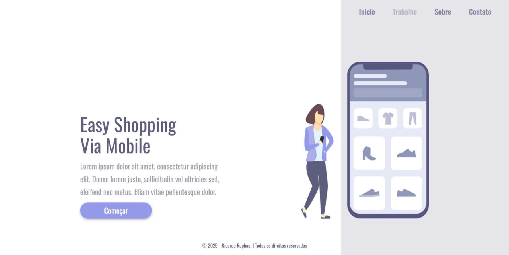
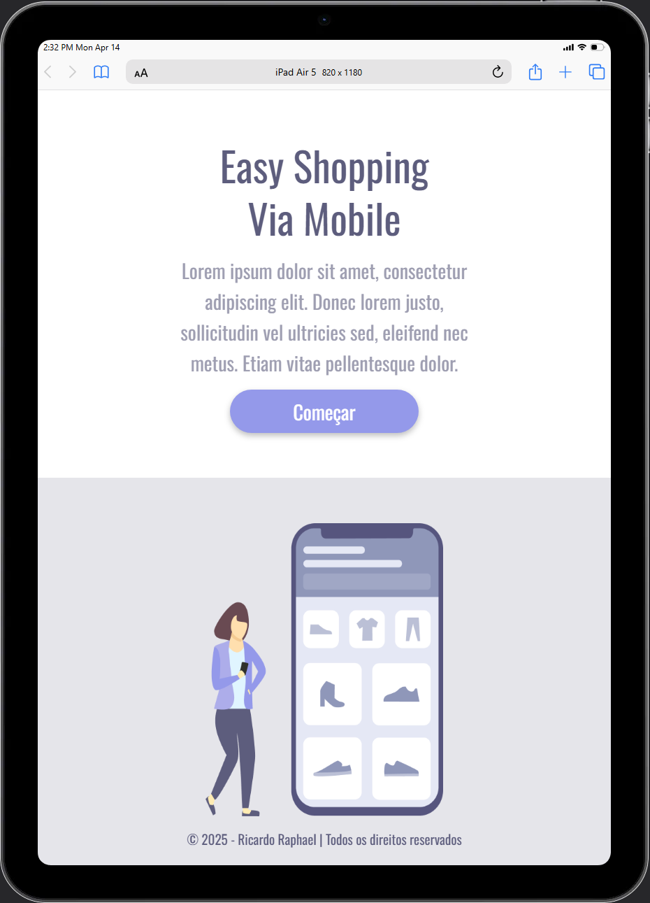

<h1 align="center">Easy Shopping Mobile</h1>
 
<h2 align="center">Projeto desenvolvido como desafio no módulo de CSS pt2 no curso de Formação Full-Stack <a href="https://rodolfomori.com.br/devclub-comercial/">DevClub</a></h2>
 

  Este projeto simula uma página inicial de um site de vendas online, utilizei HTML semântico com uma estrutura básica para aplicar o que aprendi nas aulas de HTML do curso, 
  utilizei propriedades para estilizar com CSS e media-query para definir os break points (pontos de quebra) 
  para fazer a responsiva e pode ser acessado em diferentes dispositivos móveis.
  O projeto apresenta algumas animações com pseudo classe active ao pressionar o botão e hover ao passar o mouse sobre o menu.

 
<h3>Tecnologias utilizadas:</h3>
 

  
  

 

Abaixo algumas imagens do projeto finalizado.

<h3>Imagens do projeto:</h3>
 

  
  

